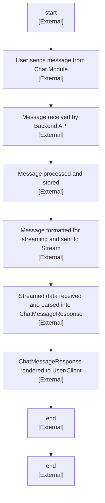

# Unnamed CodeViz Diagram

```mermaid
graph TD

    chat_message_flow.cv::start1["start<br>[External]"]
    chat_message_flow.cv::a2["User sends message from Chat Module<br>[External]"]
    chat_message_flow.cv::a3["Message received by Backend API<br>[External]"]
    chat_message_flow.cv::a4["Message processed and stored<br>[External]"]
    chat_message_flow.cv::a5["Message formatted for streaming and sent to Stream<br>[External]"]
    chat_message_flow.cv::a6["Streamed data received and parsed into ChatMessageResponse<br>[External]"]
    chat_message_flow.cv::a7["ChatMessageResponse rendered to User/Client<br>[External]"]
    chat_message_flow.cv::end8["end<br>[External]"]
    chat_message_flow.cv::end9["end<br>[External]"]
    %% Edges at this level (grouped by source)
    chat_message_flow.cv::start1["start<br>[External]"] --> chat_message_flow.cv::a2["User sends message from Chat Module<br>[External]"]
    chat_message_flow.cv::a2["User sends message from Chat Module<br>[External]"] --> chat_message_flow.cv::a3["Message received by Backend API<br>[External]"]
    chat_message_flow.cv::a3["Message received by Backend API<br>[External]"] --> chat_message_flow.cv::a4["Message processed and stored<br>[External]"]
    chat_message_flow.cv::a4["Message processed and stored<br>[External]"] --> chat_message_flow.cv::a5["Message formatted for streaming and sent to Stream<br>[External]"]
    chat_message_flow.cv::a5["Message formatted for streaming and sent to Stream<br>[External]"] --> chat_message_flow.cv::a6["Streamed data received and parsed into ChatMessageResponse<br>[External]"]
    chat_message_flow.cv::a6["Streamed data received and parsed into ChatMessageResponse<br>[External]"] --> chat_message_flow.cv::a7["ChatMessageResponse rendered to User/Client<br>[External]"]
    chat_message_flow.cv::a7["ChatMessageResponse rendered to User/Client<br>[External]"] --> chat_message_flow.cv::end8["end<br>[External]"]
    chat_message_flow.cv::end8["end<br>[External]"] --> chat_message_flow.cv::end9["end<br>[External]"]

```
---
*Generated by [CodeViz.ai](https://codeviz.ai) on 11/19/2025, 9:50:55 AM*
