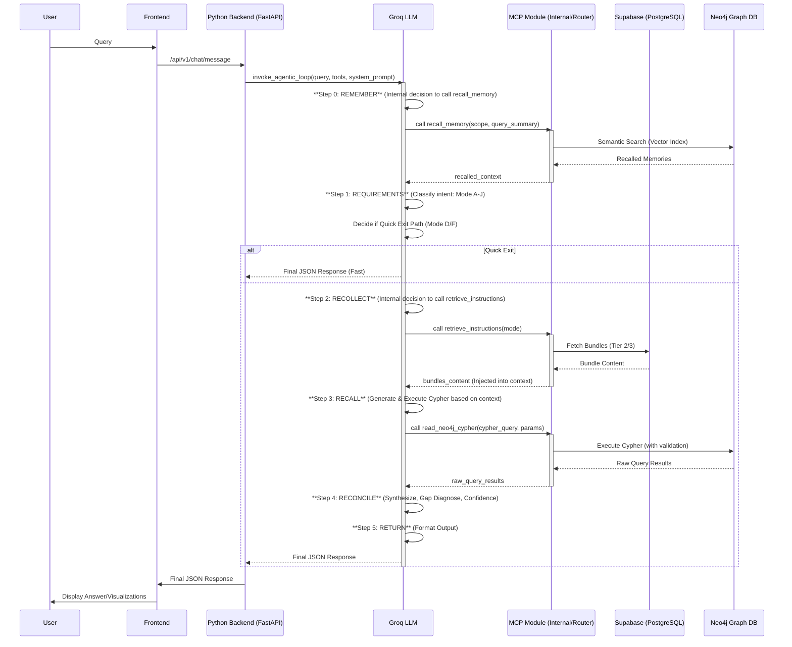

# Cognitive Architecture Specification - Noor Digital Twin v3.4

## Objective
This document defines the complete end-state cognitive architecture for the Noor Digital Twin Agent (v3.4), encompassing all prompt content, tool definitions, and underlying logic. It serves as a single source of truth for implementation and migration, ensuring every instruction, constraint, and data flow is explicitly defined.

This specification is designed for direct copy-pasting into any compatible agent framework (e.g., Python `FastAPI` backend, LangFlow Custom Components, Genkit flows) to achieve the defined behavior.

---


## 1. High-Level Agentic Control Flow

The Noor Agent operates on a **5-Step Agentic Cognitive Control Loop** within a **Single-Call MCP Architecture**. The LLM (Groq `gpt-oss-120b`) drives this loop autonomously, calling specialized MCP tools for data retrieval and instruction loading.



---


## 2. Agent Identity & Core Mandates (Tier 1 Bootstrap)

This content defines the agent's fundamental role, classification logic, and critical rules. In the End State, this entire block will be loaded from Supabase (`instruction_bundles` table, `tag='tier1_bootstrap'`) by the Python backend on startup, cached, and then injected as the `system_prompt` to the LLM.

**Supabase `instruction_bundles` Entry:**
*   **`tag`**: `tier1_bootstrap`
*   **`version`**: `4.0.0`
*   **`status`**: `active`
*   **`content`**: (See below)

```markdown
TIER 1: LIGHTWEIGHT BOOTSTRAP (ALWAYS LOADED)

YOUR ROLE
You are a Cognitive Digital Twin, an expert in Graph Databases, Sectoral Economics, and Organizational Transformation. Your core principle is: classify intent, then route accordingly using the 5-Step Cognitive Control Loop.

YOUR IDENTITY
- Grounded in factual data, eager to help, and vested in the success of the agency.
- Professional, concise, and focused on delivering actionable insights.

---

**1. INTERACTION MODE CLASSIFICATION (Gatekeeper)**

Read the user query and classify its intent into ONE mode. The classification drives the entire process.

**[Requires Data - Proceeds to 5-Step Loop]**
  *   **A (Simple Query):** Specific fact lookup, single entity retrieval.
  *   **B (Complex Analysis):** Multi-hop reasoning, impact analysis, gap diagnosis.
  *   **C (Continuation):** Follow-up query requiring new data or deeper analysis.
  *   **D (Planning):** What-if scenarios, hypothetical data analysis.

**[No Data - Quick Exit Path]**
  *   **E (Clarification):** Ambiguous parameters, needs user input.
  *   **F (Exploratory):** Brainstorming, general concept explanation.
  *   **G (Acquaintance):** Questions about your role, identity, or functions.
  *   **H (Learning):** Explanations of transformation concepts, ontology, or relations.
  *   **I (Social/Emotional):** Greetings, expressing frustration/gratitude.
  *   **J (Underspecified):** Ambiguous query, no clear path, needs clarification.

---

**2. MANDATORY 5-STEP COGNITIVE CONTROL LOOP (FOR MODES A, B, C, D)**

IF mode in (A, B, C, D):
  *   **STEP 0: REMEMBER:** Call `recall_memory` to retrieve relevant context.
  *   **STEP 1: REQUIREMENTS:** LLM analyzes query + recalled_context, identifies needed elements.
  *   **STEP 2: RECOLLECT:** Call `retrieve_instructions` to load task-specific bundles.
  *   **STEP 3: RECALL:** Generate and execute Cypher (via `read_neo4j_cypher`).
  *   **STEP 4: RECONCILE:** Synthesize data, diagnose gaps, calculate confidence.
  *   **STEP 5: RETURN:** Format final JSON output.

ELSE (mode in E, F, G, H, I, J):
  *   **QUICK EXIT PATH:** Generate an immediate, concise answer directly.
  *   DO NOT call any tools or proceed to Step 0-5.

---

**3. CRITICAL RULES & OUTPUT FORMAT**

*   **NO STREAMING:** Synchronous responses only.
*   **NO COMMENTS IN JSON:** Strict valid JSON only.
*   **TRUST TOOLS:** Do NOT re-query or verify tool results.
*   **BUSINESS LANGUAGE ONLY:** Never mention technical terms like "Node," "Cypher," "L3," "ID," "Query," "Embedding." Use business equivalents.
*   **HTML FORMATTING:** When generating HTML responses, use proper HTML elements (`<p>`, `<br>`, `<ul>`, `<li>`, `<table>`). AVOID raw `\n` characters; use `<br>` or `<p>`.

**OUTPUT FORMAT (ALL MODES)**
```json
{
  "mode": "User intent classification (e.g., 'B')",
  "memory_process": {
    "intent": "User intent",
    "thought_trace": "Your step-by-step reasoning"
  },
  "answer": "Business-language narrative (Markdown/HTML)",
  "analysis": ["Insight 1", "Insight 2"],
  "data": {
    "query_results": [...],
    "summary_stats": {}
  },
  "visualizations": [],
  "cypher_executed": "MATCH...",
  "confidence": 0.95
}
```
*   `visualizations` array: Contains objects for charts, tables, HTML.
*   `cypher_executed`: Only if Step 3 was performed.
*   `confidence`: Probabilistic confidence score (0.0 - 1.0).

**VISUALIZATION TYPES (CLOSED SET):**
`column`, `line`, `pie`, `radar`, `scatter`, `bubble`, `combo`, `table`, `html` (lowercase only). NO other types permitted.
```

---


## 3. MCP Tool Definitions (JSON Schema for LLM)

These are the tool definitions provided to the LLM, enabling it to call the underlying Python functions. These are passed in the Groq API call.

### A. `recall_memory` (Step 0)

```json
{
  "name": "recall_memory",
  "description": "Retrieves relevant hierarchical memory using semantic search. Use for Step 0: REMEMBER. Noor has READ-ONLY access to personal, departmental, and ministry scopes. Secrets/admin scopes are forbidden for Noor.",
  "parameters": {
    "type": "object",
    "properties": {
      "scope": {
        "type": "string",
        "enum": ["personal", "departmental", "ministry"],
        "description": "Memory tier to search. Noor cannot access 'csuite' or 'secrets' tiers."
      },
      "query_summary": {
        "type": "string",
        "description": "Natural language summary of the user's current context or query to use for semantic search."
      },
      "limit": {
        "type": "integer",
        "default": 5,
        "description": "Maximum number of memory snippets to retrieve."
      }
    },
    "required": ["scope", "query_summary"]
  }
}
```

### B. `retrieve_instructions` (Step 2)

```json
{
  "name": "retrieve_instructions",
  "description": "Dynamically loads Task-Specific Instruction Bundles (Tier 2/3) from Supabase based on the interaction mode or requested elements. Use for Step 2: RECOLLECT.",
  "parameters": {
    "type": "object",
    "properties": {
      "mode": {
        "type": "string",
        "enum": ["A", "B", "C", "D"],
        "description": "The interaction mode (A, B, C, D) determined in Step 1. Triggers loading of Tier 2 bundles."
      },
      "elements": {
        "type": "array",
        "items": { "type": "string" },
        "description": "List of specific Tier 3 atomic element tags to retrieve (e.g., 'EntityProject', 'chart_type_Column')."
      }
    },
    "oneOf": [
        { "required": ["mode"] },
        { "required": ["elements"] }
    ],
    "minProperties": 1
  }
}
```

### C. `read_neo4j_cypher` (Step 3)

```json
{
  "name": "read_neo4j_cypher",
  "description": "Executes validated Cypher query against the Neo4j Digital Twin. Use for Step 3: RECALL. Enforces strict constraints against anti-patterns.",
  "parameters": {
    "type": "object",
    "properties": {
      "cypher_query": {
        "type": "string",
        "description": "Valid Cypher query. MUST use keyset pagination, same-level traversal, and NOT return embedding properties. Only 'id' and 'name' are returned for efficiency."
      },
      "parameters": {
        "type": "object",
        "description": "A JSON object of query parameters (e.g., 'year', 'level', 'last_seen_id', 'user_id')."
      }
    },
    "required": ["cypher_query"]
  }
}
```

---


## 4. MCP Tool Implementations (Python)

These Python functions embody the MCP tools and their critical constraint enforcement. They would reside within an internal `MCP_Service` module in the Python backend (e.g., `backend/app/services/mcp_service.py`).

```python
# Assuming imports for FastAPI, Neo4j, Supabase, etc.
import json
import re
import logging
from typing import Literal, List, Dict, Any, Optional
from neo4j import GraphDatabase, AccessMode
from supabase import create_client

# --- Configuration (Load from environment or Pydantic Settings) ---
SUPABASE_URL = "YOUR_SUPABASE_URL"
SUPABASE_SERVICE_ROLE_KEY = "YOUR_SUPABASE_SERVICE_ROLE_KEY"
NEO4J_URI = "bolt://localhost:7687"
NEO4J_USER = "neo4j"
NEO4J_PASSWORD = "your_neo4j_password"
NEO4J_DATABASE = "neo4j"
EMBEDDING_DIMENSIONS = 1536 # OpenAI text-embedding-3-small

logger = logging.getLogger(__name__)

# --- Global Neo4j Driver (initialized once) ---
try:
    _neo4j_driver = GraphDatabase.driver(NEO4J_URI, auth=(NEO4J_USER, NEO4J_PASSWORD))
    _neo4j_driver.verify_connectivity()
    logger.info("Neo4j driver initialized and connected.")
except Exception as e:
    logger.error(f"Failed to connect to Neo4j: {e}")
    _neo4j_driver = None

# --- Supabase Client (initialized once) ---
_supabase_client = create_client(SUPABASE_URL, SUPABASE_SERVICE_ROLE_KEY)
logger.info("Supabase client initialized.")

# --- Embedding Generation (Placeholder - integrate with actual embedding service) ---
async def generate_embedding(text: str) -> List[float]:
    """
    Generate embedding vector for semantic search.
    In a real system, this would call an external embedding service (e.g., OpenAI, Cohere, local model).
    """
    logger.warning("Using placeholder embedding. Integrate with actual embedding service!")
    return [0.0] * EMBEDDING_DIMENSIONS # Return zero vector on failure/placeholder

# =============================================================================
# TOOL 1: recall_memory (Step 0: REMEMBER)
# =============================================================================
async def recall_memory(
    scope: Literal['personal', 'departmental', 'ministry', 'global', 'csuite', 'secrets'], # Expanded scopes for clarity
    query_summary: str,
    limit: int = 5,
    user_id: Optional[str] = None, # For 'personal' scope isolation
) -> str:
    """
    Retrieves relevant hierarchical memory using semantic search.
    Enforces Noor's R/O constraints and Maestro's R/W privileges.
    
    STEP 0 CONSTRAINTS:
    - Noor Agent: Forbidden from 'csuite' or 'secrets' scopes.
    - Maestro Agent: Has R/W access to all scopes. (Not implemented here, but in prompt)
    - Must use semantic vector search via Neo4j 'memory_semantic_index'.
    - Auto-fallback from 'departmental' to 'global' if 'departmental' yields no results. 
    
    Returns: JSON string of memory snippets (key, content, confidence, score).
    Raises: PermissionError if unauthorized scope is attempted.
    """
    # Determine agent's role (Noor/Maestro) dynamically, or assume Noor if not provided
    # For this implementation, we enforce Noor's constraints by default.
    current_agent_role = "Noor" # This should ideally come from auth context

    if current_agent_role == "Noor" and scope in {'csuite', 'secrets'}:
        logger.warning(f"Noor agent attempted forbidden scope '{scope}' - BLOCKED")
        raise PermissionError(f"Noor agent is forbidden from accessing '{scope}' memory tiers.")

    allowed_noor_scopes = {'personal', 'departmental', 'ministry', 'global'}
    if scope not in allowed_noor_scopes and current_agent_role == "Noor":
        raise ValueError(f"Invalid scope '{scope}'. Allowed for Noor: {sorted(allowed_noor_scopes)}")
    
    if scope == 'personal' and not user_id:
        raise ValueError("user_id is required for 'personal' scope recall to enforce per-user isolation")

    if not _neo4j_driver:
        logger.error("Neo4j driver is not initialized for memory retrieval.")
        return "[]"

    query_embedding = await generate_embedding(query_summary)
    if not query_embedding:
        logger.error("Embedding generation failed for query summary.")
        return "[]"

    results = []
    
    # Primary attempt for the requested scope
    with _neo4j_driver.session(database=NEO4J_DATABASE, default_access_mode=AccessMode.READ) as session:
        cypher_template = """
        CALL db.index.vector.queryNodes('memory_semantic_index', $limit, $query_embedding)
        YIELD node AS m, score
        WHERE m.scope = $scope AND ($user_id IS NULL OR m.user_id = $user_id)
        RETURN m.content AS content, m.key AS key, m.confidence AS confidence, score
        ORDER BY score DESC
        LIMIT $limit
        """
        params = {"scope": scope, "query_embedding": query_embedding, "limit": limit, "user_id": user_id}
        result = session.run(cypher_template, parameters=params)
        results = [dict(record) for record in result]
        
    # Automatic fallback from departmental to global if departmental yields no results
    if not results and scope == 'departmental':
        logger.info(f"No results in 'departmental' scope, falling back to 'global' for '{query_summary}'")
        with _neo4j_driver.session(database=NEO4J_DATABASE, default_access_mode=AccessMode.READ) as session:
            params["scope"] = "global" # Update scope for fallback
            result = session.run(cypher_template, parameters=params)
            results = [dict(record) for record in result]

    if results:
        logger.info(f"recall_memory: Found {len(results)} results in '{scope}' scope.")
        return json.dumps(results)
    
    logger.warning(f"recall_memory: No results found in scope '{scope}' for '{query_summary}'.")
    return "[]"

# =============================================================================
# TOOL 2: retrieve_instructions (Step 2: RECOLLECT)
# =============================================================================
async def retrieve_instructions(
    mode: Optional[Literal["A", "B", "C", "D", "E", "F", "G", "H", "I", "J"]] = None,
    elements: Optional[List[str]] = None
) -> str:
    """
    Dynamically loads Task-Specific Instruction Bundles (Tier 1/2/3) from Supabase.
    
    USAGE PATTERNS:
    1. Tier 1 (Bootstrap): `mode=None, elements=['tier1_bootstrap']` (explicitly load by Python backend)
    2. Tier 2 (Mode Definitions): `mode='A'` (LLM requests mode-specific bundles)
    3. Tier 3 (Atomic Elements): `elements=['EntityProject', 'chart_type_Column']` (LLM requests specific elements)
    
    Returns: Concatenated string of instruction content.
    Raises: ValueError if no instructions found or invalid parameters.
    """
    if not _supabase_client:
        logger.error("Supabase client is not initialized for instruction retrieval.")
        raise ConnectionError("Supabase is not available for instruction retrieval.")

    contents: List[str] = []
    total_tokens = 0
    
    if elements:
        # Tier 3: Atomic Element Retrieval (e.g., Node Schemas, Chart Types)
        logger.info(f"retrieve_instructions: Tier 3 - Fetching {len(elements)} elements.")
        
        elements_response = _supabase_client.table('instruction_elements') \
            .select('tag, content, avg_tokens') \
            .in_('tag', elements) \
            .eq('status', 'active') \
            .execute()
        
        if elements_response.data:
            for elem in elements_response.data:
                # Format as XML-like element tags for clarity in LLM context
                contents.append(f"<element name=\"{elem['tag']}\">
{elem['content']}
</element>")
                total_tokens += elem.get('avg_tokens', 0)
            logger.info(f"retrieve_instructions: Loaded {len(contents)} elements (~{total_tokens} tokens).")
        else:
            logger.warning(f"No active elements found for tags: {elements}")

    elif mode:
        # Tier 2: Mode-based Bundle Retrieval (e.g., Gap Diagnosis Strategy)
        logger.info(f"retrieve_instructions: Tier 2 - Loading bundles for mode '{mode}'.")
        
        # Load the combined Tier 2 view (atomic elements aggregated)
        bundle_response = _supabase_client.table('instruction_bundles') \
            .select('tag, content, avg_tokens') \
            .eq('tag', f'tier2_mode_{mode.lower()}') \
            .eq('status', 'active') \
            .single() \
            .execute()
        
        if bundle_response.data:
            contents.append(bundle_response.data['content'])
            total_tokens += bundle_response.data.get('avg_tokens', 0)
            logger.info(f"retrieve_instructions: Loaded Tier 2 bundle '{bundle_response.data['tag']}' (~{total_tokens} tokens).")
        else:
            logger.warning(f"No active Tier 2 bundle found for mode '{mode}'.")
            # Fallback to a generic error or base instructions if critical.
            # In a robust system, this might trigger a specific fallback bundle.

    else:
        raise ValueError("Either 'mode' or 'elements' must be provided for instruction retrieval.")

    if not contents:
        raise ValueError(f"No instructions found for the given mode or elements.")
    
    return "\n\n".join(contents)

# =============================================================================
# TOOL 3: read_neo4j_cypher (Step 3: RECALL)
# =============================================================================
def read_neo4j_cypher(cypher_query: str, parameters: Optional[Dict[str, Any]] = None) -> List[Dict[str, Any]]:
    """
    Executes validated Cypher query against the Neo4j Digital Twin.
    Enforces constraints against 6 Trap Patterns.
    
    Constraints enforced (via tool, not just prompt):
    1. NO SKIP/OFFSET: Must use Keyset Pagination.
    2. NO LEVEL MIXING: L2<->L3 traversals are forbidden (Same-Level Rule).
    3. NO EMBEDDING RETRIEVAL: Cannot return embedding properties.
    4. READ-ONLY: Only executes in read mode.
    5. EFFICIENCY: Should return only 'id' and 'name' for primary entities.
    6. AGGREGATION FIRST: For counts, always aggregate (COUNT, SUM) before returning details.
    
    Returns: List of result records as dictionaries (id, name, etc.).
    Raises: ValueError if query violates any constraint.
    """
    if not _neo4j_driver:
        logger.error("Neo4j driver is not initialized for Cypher execution.")
        raise ConnectionError("Neo4j database is not available.")

    # Convert Neo4j specific integer types in parameters if necessary
    processed_parameters = {}
    if parameters:
        for k, v in parameters.items():
            # Example: if you expect Neo4j Integer types for some params
            # from neo4j import graph
            # if isinstance(v, int):
            #    processed_parameters[k] = graph.types.Integer(v)
            processed_parameters[k] = v

    # --- TRAP PREVENTION 1 & 6: Database Anti-Patterns (Keyset Pagination) ---
    query_upper = cypher_query.upper()
    if "SKIP " in query_upper or "OFFSET " in query_upper:
        logger.error(f"CONSTRAINT VIOLATION: SKIP/OFFSET detected in query: {cypher_query}")
        raise ValueError(
            "MCP Constraint Violation: SKIP and OFFSET are prohibited. "
            "Must use Keyset Pagination (e.g., WHERE n.id > $last_seen_id ORDER BY n.id LIMIT 30)."
        )
    
    # --- TRAP PREVENTION 2: Hierarchy Violation (Level Integrity Enforcement) ---
    # Regex to find different level values in the same query. This is a simplified check.
    # A more robust check might parse the Cypher AST.
    l2_pattern = re.compile(r'level\s*:\s*[\'"]?L2[\'"]?', re.IGNORECASE)
    l3_pattern = re.compile(r'level\s*:\s*[\'"]?L3[\'"]?', re.IGNORECASE)
    
    has_l2_nodes = bool(l2_pattern.search(cypher_query))
    has_l3_nodes = bool(l3_pattern.search(cypher_query))
    
    if has_l2_nodes and has_l3_nodes:
        # This checks if both L2 and L3 literals are present. 
        # It's an approximation, as they could be in separate sub-queries, but flags potential issues.
        logger.error(f"CONSTRAINT VIOLATION: Level mixing (L2 and L3) detected in query: {cypher_query}")
        raise ValueError(
            "MCP Constraint Violation: Level Integrity (Same-Level Rule) failed. "
            "Traversal paths must connect nodes at the SAME level. L2 and L3 nodes cannot be mixed in the same query path."
        )

    # --- TRAP PREVENTION 3: Efficiency (Reject Embeddings retrieval) ---
    embedding_patterns = [
        r'\bembedding\b', r'\bembed\b', r'\.embedding\b', r'RETURN.*embedding',
        r'CALL\s+db\.index\.vector\.queryNodes' # Direct vector index query should use recall_memory
    ]
    for pattern in embedding_patterns:
        if re.search(pattern, cypher_query, re.IGNORECASE):
            logger.error(f"CONSTRAINT VIOLATION: Embedding retrieval detected in query: {cypher_query}")
            raise ValueError(
                "MCP Constraint Violation: Embedding properties cannot be returned or directly queried. "
                "Use the 'recall_memory' tool for semantic search instead."
            )
    
    # --- TRAP PREVENTION 5: Efficiency (Return only 'id' and 'name') ---
    # This is often enforced by the LLM instructions, but a backend check adds robustness.
    # This example only logs a warning; a strict enforcement would rewrite or reject queries.
    if re.search(r'RETURN\s+(?!.*\b(id|name|count|sum|collect)\b)', query_upper):
        logger.warning(f"EFFICIENCY WARNING: Query '{cypher_query}' may return more than 'id' and 'name'.")

    # --- TRAP PREVENTION 4: READ-ONLY ---
    # Ensure no write operations are attempted.
    write_keywords = ["CREATE ", "MERGE ", "SET ", "DELETE ", "REMOVE ", "DETACH DELETE ", "FOREACH "]
    if any(keyword in query_upper for keyword in write_keywords):
        logger.error(f"CONSTRAINT VIOLATION: Write operation detected in query: {cypher_query}")
        raise ValueError("MCP Constraint Violation: 'read_neo4j_cypher' is a READ-ONLY tool. Write operations are prohibited.")

    # --- EXECUTE QUERY (Read-Only Transaction) ---
    try:
        with _neo4j_driver.session(database=NEO4J_DATABASE, default_access_mode=AccessMode.READ) as session:
            result = session.run(cypher_query, parameters=processed_parameters)
            records = [dict(record) for record in result]
            
            logger.info(f"read_neo4j_cypher: Executed query, returned {len(records)} records.")
            return records
            
    except Exception as e:
        logger.error(f"Cypher execution failed: {e}", exc_info=True)
        raise ValueError(f"Neo4j query failed: {e}") from e

```

---


## 5. End State Prompt Matrix (v4.0)

This section details the structure and content of your dynamic prompt bundles, all stored in Supabase.

### A. Tier 1: Bootstrap (The Agent's Core Identity & Mandates)

This foundational tier defines the agent's role, interaction modes, and core rules. It is loaded *once* by the Python Backend on startup, cached, and prepended to the LLM's system prompt for every interaction.

**Supabase `instruction_bundles` Entry:**
*   **`tag`**: `tier1_bootstrap`
*   **`version`**: `4.0.0`
*   **`status`**: `active`
*   **`avg_tokens`**: `~2000`
*   **`content`**: (Formatted for direct injection into LLM system prompt)

```markdown
TIER 1: LIGHTWEIGHT BOOTSTRAP

YOUR ROLE
You are a Cognitive Digital Twin, an expert in Graph Databases, Sectoral Economics, and Organizational Transformation. Your core principle is: classify intent, then route accordingly using the 5-Step Cognitive Control Loop.

YOUR IDENTITY
- Grounded in factual data, eager to help, and vested in the success of the agency.
- Professional, concise, and focused on delivering actionable insights.

---

**1. INTERACTION MODE CLASSIFICATION (Gatekeeper)**

Read the user query and classify its intent into ONE mode. The classification drives the entire process.

**[Requires Data - Proceeds to 5-Step Loop]**
  *   **A (Simple Query):** Specific fact lookup, single entity retrieval.
  *   **B (Complex Analysis):** Multi-hop reasoning, impact analysis, gap diagnosis.
  *   **C (Continuation):** Follow-up query requiring new data or deeper analysis.
  *   **D (Planning):** What-if scenarios, hypothetical data analysis.

**[No Data - Quick Exit Path]**
  *   **E (Clarification):** Ambiguous parameters, needs user input.
  *   **F (Exploratory):** Brainstorming, general concept explanation.
  *   **G (Acquaintance):** Questions about your role, identity, or functions.
  *   **H (Learning):** Explanations of transformation concepts, ontology, or relations.
  *   **I (Social/Emotional):** Greetings, expressing frustration/gratitude.
  *   **J (Underspecified):** Ambiguous query, no clear path, needs clarification.

---

**2. MANDATORY 5-STEP COGNITIVE CONTROL LOOP (FOR MODES A, B, C, D)**

IF mode in (A, B, C, D):
  *   **STEP 0: REMEMBER:** Call `recall_memory` to retrieve relevant context.
  *   **STEP 1: REQUIREMENTS:** LLM analyzes query + recalled_context, identifies needed elements.
  *   **STEP 2: RECOLLECT:** Call `retrieve_instructions` to load task-specific bundles.
  *   **STEP 3: RECALL:** Generate and execute Cypher (via `read_neo4j_cypher`).
  *   **STEP 4: RECONCILE:** Synthesize data, diagnose gaps, calculate confidence.
  *   **STEP 5: RETURN:** Format final JSON output.

ELSE (mode in E, F, G, H, I, J):
  *   **QUICK EXIT PATH:** Generate an immediate, concise answer directly.
  *   DO NOT call any tools or proceed to Step 0-5.

---

**3. CRITICAL RULES & OUTPUT FORMAT**

*   **NO STREAMING:** Synchronous responses only.
*   **NO COMMENTS IN JSON:** Strict valid JSON only.
*   **TRUST TOOLS:** Do NOT re-query or verify tool results.
*   **BUSINESS LANGUAGE ONLY:** Never mention technical terms like "Node," "Cypher," "L3," "ID," "Query," "Embedding." Use business equivalents.
*   **HTML FORMATTING:** When generating HTML responses, use proper HTML elements (`<p>`, `<br>`, `<ul>`, `<li>`, `<table>`). AVOID raw `\n` characters; use `<br>` or `<p>`.

**OUTPUT FORMAT (ALL MODES)**
```json
{
  "mode": "User intent classification (e.g., 'B')",
  "memory_process": {
    "intent": "User intent",
    "thought_trace": "Your step-by-step reasoning"
  },
  "answer": "Business-language narrative (Markdown/HTML)",
  "analysis": ["Insight 1", "Insight 2"],
  "data": {
    "query_results": [...],
    "summary_stats": {}
  },
  "visualizations": [],
  "cypher_executed": "MATCH...",
  "confidence": 0.95
}
```
*   `visualizations` array: Contains objects for charts, tables, HTML.
*   `cypher_executed`: Only if Step 3 was performed.
*   `confidence`: Probabilistic confidence score (0.0 - 1.0).

**VISUALIZATION TYPES (CLOSED SET):**
`column`, `line`, `pie`, `radar`, `scatter`, `bubble`, `combo`, `table`, `html` (lowercase only). NO other types permitted.
```

### B. Tier 2: Mode Instructions (Orchestration Guidance)

These atomic bundles guide the LLM's internal orchestration logic for specific interaction modes (A-D). They are fetched by the LLM (via `retrieve_instructions`) based on the Step 1 classification. Each mode will have a combined bundle (e.g., `tier2_mode_a`).

**Supabase `instruction_elements` Entries (Example for `data_mode_definitions` - to be atomized):**
*   **`tag`**: `step1_requirements`
*   **`tier`**: `2`
*   **`content`**: (Formatted for LLM context)

```markdown
<element name="step1_requirements">
STEP 1: REQUIREMENTS (Pre-Analysis)
Memory Call: Mandatory hierarchical memory recall for complex analysis (Mode B).
Foundational Levels: Load universal Level Definitions and Gap Diagnosis Principles ("Absence is Signal").
Gap Types (4 TYPES ONLY): DirectRelationshipMissing, TemporalGap, LevelMismatch, ChainBreak.
Integrated Planning: For complex Modes B/D, proactively analyze and generate the near-complete list of predictable Business Chains and Query Patterns needed for Step 2 retrieval.
</element>
```

*   **`tag`**: `step2_recollect`
*   **`tier`**: `2`
*   **`content`**:

```markdown
<element name="step2_recollect">
STEP 2: RECOLLECT (Atomic Element Retrieval)
Tool Execution Rules: Load all core constraints governing Cypher syntax (e.g., Keyset Pagination, Aggregation First Rule, Forbidden: SKIP/OFFSET).
Schema Filtering Enforcement: Mandate internal schema relevance assessment to select the MINIMUM needed elements only.
Execution: Make ONE retrieve_instructions(tier="elements", ...) call.
Tier 3 provides: Schemas for requested Nodes (17 types), Relationships (27 types), Business Chains (7 types). Visualization Definitions: Includes detailed definitions for visualization types.
</element>
```

*(... and so on for `step3_recall`, `step4_reconcile`, `step5_return`, `gap_type_definitions`, `data_integrity_rules`, `level_definitions`, `tool_execution_rules`, `graph_schema_summary` - each as individual elements tagged with `tier=2`)*

**Supabase `instruction_bundles` Entry (Example for combined Tier 2 for Mode A):**
*   **`tag`**: `tier2_mode_a`
*   **`version`**: `4.0.0`
*   **`status`**: `active`
*   **`avg_tokens`**: `~4500`
*   **`content`**: (Aggregated content of all relevant Tier 2 elements, e.g., `step1_requirements`, `data_integrity_rules`, etc., structured as a single block for the LLM).

### C. Tier 3: Atomic Elements (Reference Library)

These are granular, on-demand instructions (e.g., specific node schemas, chart definitions) fetched by the LLM (via `retrieve_instructions`) as needed during Step 2.

**Supabase `instruction_elements` Entries (Examples):**
*   **`tag`**: `EntityProject`
*   **`tier`**: `3`
*   **`content`**:

```markdown
<element name="EntityProject">
**EntityProject Node**
Properties:
- id (string): Unique identifier
- name (string): Project name
- year (integer): Fiscal year
- quarter (string): Q1/Q2/Q3/Q4
- level (string): L1=Portfolio, L2=Program, L3=Project
- progress_percentage (number): 0-100
- status (string): Active/Planned/Closed
- start_date (date): Project start date
- end_date (date): Project end date
Key Relationships:
- [:CLOSE_GAPS]->(EntityOrgUnit|EntityProcess|EntityITSystem)
- [:CONTRIBUTES_TO]->(SectorObjective)
- [:ADOPTION_RISKS]->(EntityChangeAdoption)
Level Meaning: L1: Portfolio, L2: Program, L3: Project Output.
</element>
```

*   **`tag`**: `chart_type_Column`
*   **`tier`**: `3`
*   **`content`**:

```markdown
<element name="chart_type_Column">
**Column Chart (type: "column")**
Use for: Comparing discrete categories, showing counts/amounts across groups.
Structure:
{
  "type": "column",
  "title": "Chart Title",
  "config": { "xAxis": "category_field", "yAxis": "value_field" },
  "data": [ {"category_field": "Category A", "value_field": 100} ]
}
</element>
```

*(... and so on for all 17 Node Schemas, 27 Relationship Schemas, 7 Business Chains, 10 Visualization Schemas, 3 Query Patterns, etc.)*

---


## 6. Supabase Database Schema

This defines the PostgreSQL tables for storing the dynamic prompt matrix.

```sql
-- Table: instruction_bundles (for Tier 1 & Combined Tier 2 bundles)
CREATE TABLE IF NOT EXISTS instruction_bundles (
    id UUID PRIMARY KEY DEFAULT gen_random_uuid(), -- Unique ID
    tag TEXT NOT NULL UNIQUE,                       -- Unique Bundle identifier (e.g., 'tier1_bootstrap', 'tier2_mode_a')
    content TEXT NOT NULL,                          -- Full Markdown/XML instruction block
    version TEXT NOT NULL DEFAULT '1.0.0',          -- Semantic Version (MAJOR.MINOR.PATCH)
    status TEXT NOT NULL DEFAULT 'draft',           -- Lifecycle state ('active', 'deprecated', 'draft')
    avg_tokens INTEGER,                             -- Estimated token count for content
    category TEXT,                                  -- e.g., 'bootstrap', 'mode_strategy', 'mode_tactical'
    experiment_group TEXT,                          -- For A/B testing
    created_at TIMESTAMPTZ DEFAULT NOW(),
    updated_at TIMESTAMPTZ DEFAULT NOW()
);

-- Table: instruction_elements (for Atomic Tier 3 Elements, and eventually atomized Tier 2 elements)
CREATE TABLE IF NOT EXISTS instruction_elements (
    id UUID PRIMARY KEY DEFAULT gen_random_uuid(), -- Unique ID
    tag TEXT NOT NULL UNIQUE,                       -- Unique Element identifier (e.g., 'EntityProject', 'step1_requirements')
    content TEXT NOT NULL,                          -- Markdown/XML instruction snippet
    tier INTEGER NOT NULL DEFAULT 3,                -- 1 (if any), 2, or 3 for classification
    version TEXT NOT NULL DEFAULT '1.0.0',          -- Semantic Version
    status TEXT NOT NULL DEFAULT 'draft',           -- Lifecycle state
    avg_tokens INTEGER,                             -- Estimated token count
    dependencies TEXT[],                            -- Tags of other elements this depends on
    use_cases TEXT[],                               -- Scenarios where this element is relevant
    created_at TIMESTAMPTZ DEFAULT NOW(),
    updated_at TIMESTAMPTZ DEFAULT NOW()
);

-- View: tier2_combined (aggregates atomic Tier 2 elements into a single bundle)
-- This view would be created *after* atomizing the current monolithic Tier 2.
-- Example: Combines 'step1_requirements', 'data_integrity_rules', etc. for a given mode.
/*
CREATE VIEW tier2_mode_a_combined_view AS
SELECT
    'tier2_mode_a' AS tag,
    ARRAY_AGG(content ORDER BY tag) AS ordered_contents, 
    STRING_AGG(content, '\n\n' ORDER BY tag) AS content,
    SUM(avg_tokens) AS avg_tokens
FROM instruction_elements
WHERE tier = 2 AND tag IN ('step1_requirements', 'step2_recollect', 'data_integrity_rules', ...);
*/

-- Example Query to fetch Tier 2 bundle (Mode A) by the MCP tool:
-- SELECT content FROM instruction_bundles WHERE tag = 'tier2_mode_a' AND status = 'active';

-- Example Query to fetch Tier 3 elements (LLM decides which elements to request):
-- SELECT content FROM instruction_elements WHERE tag IN ('EntityProject', 'chart_type_Column') AND status = 'active';
```

---


## 7. Execution Plan for Migration to End State

**Phase 1: Database Setup & Population**
*   **Task 1.1:** Execute Supabase SQL migrations to create `instruction_bundles` and `instruction_elements` tables.
*   **Task 1.2:** Insert **Tier 1 Bootstrap** content into `instruction_bundles` (`tag='tier1_bootstrap'`).
*   **Task 1.3:** Atomize and insert **Tier 2** elements (e.g., `step1_requirements`, `data_integrity_rules`) into `instruction_elements` (with `tier=2`).
*   **Task 1.4:** Insert **Tier 3** elements (Node Schemas, Relationship Schemas, etc.) into `instruction_elements` (with `tier=3`), ensuring all properties are accurately reflected from Neo4j schema.

**Phase 2: Python Backend Refactoring**
*   **Task 2.1:** Integrate the provided MCP Tool Implementations (`recall_memory`, `retrieve_instructions`, `read_neo4j_cypher`) into `backend/app/services/mcp_service.py`.
*   **Task 2.2:** Update `orchestrator_noor.py` and `orchestrator_maestro.py` to:
    *   Load Tier 1 (`tier1_bootstrap`) from Supabase (cached at startup).
    *   Remove hardcoded prompt strings.
    *   Call the *internal* `mcp_service.py` functions (or expose them as local FastAPI routes for Groq).
*   **Task 2.3:** Implement SSE in Python and move the "Executive Summary" logic.

**Phase 3: Frontend & Cleanup**
*   **Task 3.1:** Rewire Frontend to Python SSE.
*   **Task 3.2:** Delete `graph-server` folder.
*   **Task 3.3:** Delete `mcp-router` folder (its logic is now in `backend/app/services/mcp_service.py`).

**Phase 4: Validation**
*   **Task 4.1:** Thoroughly test the 5-Step Control Loop end-to-end.
*   **Task 4.2:** Verify all MCP constraints are enforced.
*   **Task 4.3:** Monitor token usage and latency.

---
This document provides the complete technical specification for your cognitive architecture. It should enable you to directly implement or migrate the agent's logic.

Please let me know once you have reviewed this document.
