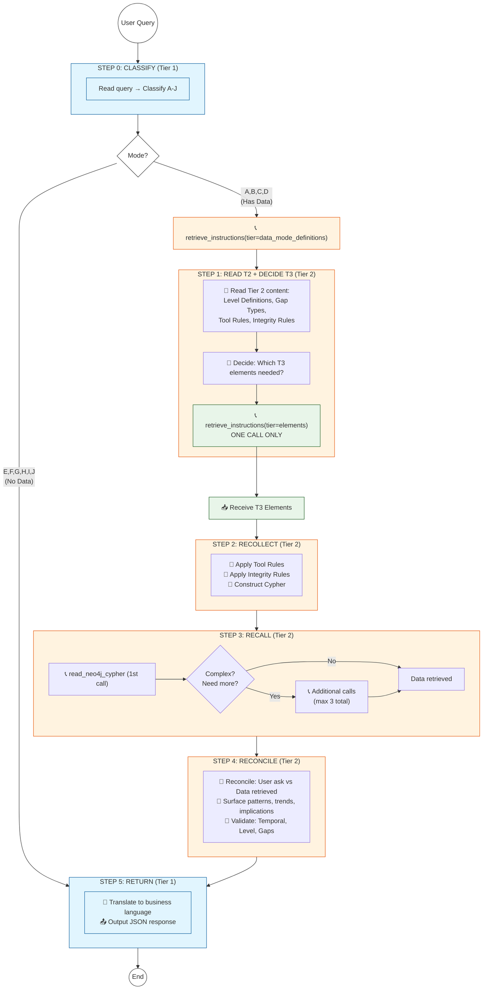
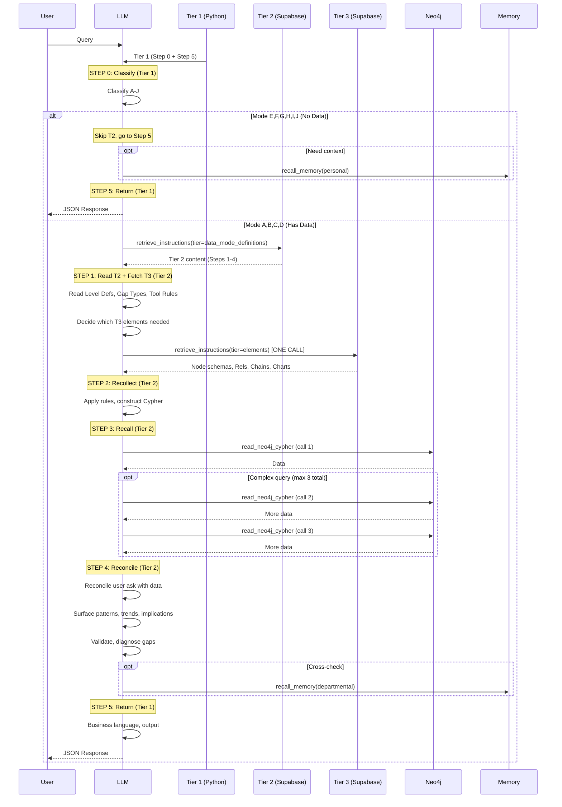

# END STATE PROMPT MATRIX v3.4

**Purpose**: This document shows the FINAL target architecture after all fixes are applied. Use this as the reference to validate all changes.

**Date**: December 2025  
**Based On**: Prompt Matrix Analysis.md (Final Prompt Architecture 3.4)

---

## Workflow-Centric Architecture

**Tier Structure:**
- 🔵 **Tier 1 (Blue)** = Step 0 + Step 5 → Python-loaded, ALL modes A-J share
- 🟠 **Tier 2 (Orange)** = Steps 1-4 → LLM-fetched, A-D modes only  
- 🟢 **Tier 3 (Green)** = Elements → ONE fetch in Step 1

**Flow:**
```
Step 0 (T1): Classify mode
  ├─ E-J (No Data) ──────────────────────────────────→ Step 5 (T1) → End
  └─ A-D (Has Data) → Fetch T2 → Step 1: Read T2, decide T3 needs
                                  → Fetch T3 (ONCE)
                                  → Steps 2-4: Process (Neo4j up to 3x)
                                  → Step 5 (T1) → End
```



---

## Step Summary

| Step | Tier | Modes | What Happens |
|------|------|-------|--------------|
| **0** | T1 | A-J | Classify mode. E-J → skip to Step 5. A-D → fetch T2. |
| **1** | T2 | A-D | Read T2 content. Decide T3 needs. Fetch T3 (ONE call). |
| **2** | T2 | A-D | Apply rules. Construct Cypher query. |
| **3** | T2 | A-D | Execute Neo4j (up to 3 calls for complex). |
| **4** | T2 | A-D | Validate results. Diagnose gaps. |
| **5** | T1 | A-J | Translate to business language. Output JSON. |

---

## Tier 1 Fundamentals (Always Loaded)
- **Multi-load:** Tier 1 is resident; Tier 2/3 are fetched only for A-D (data) modes.
- **Persona + routers:** Two agents run on separate scripts/routers. Noor (staff) uses the Noor MCP router (8201) with no secrets scope. Maestro (exec) uses the Maestro MCP router (8202) and may use secrets.
- **Memory scopes (E-J too):** Noor can recall personal/departmental/ministry only and is never told about secrets. Maestro can recall personal/departmental/ministry/secrets (exec-only context).
- **Outputs:** Step 5 always uses the same JSON schema and confidence scoring. Thought trace is omitted by default.
- **Where it lives/loads:** Tier 1 text is stored as `COGNITIVE_CONT_BUNDLE` inside `backend/app/services/orchestrator_noor.py` and `orchestrator_maestro.py` (generated from this END_STATE file via the bundle update scripts). Each orchestrator loads it into the LLM system prompt at runtime; Tier 2/3 are fetched later over MCP.

---

## E-J Modes: What's Shared?

E-J modes use **only Tier 1** (Step 0 + Step 5). They share:
- ✅ Output format (Step 5)
- ✅ Memory access rules (Tier 1)
- ✅ Visualization enumeration (Step 5)
- ✅ Business language guardrail (Step 5)

E-J modes may optionally:
- Call `recall_memory(scope=personal)` for context

E-J does NOT use:
- ❌ Tier 2 (Steps 1-4)
- ❌ Neo4j queries
- ❌ Gap diagnosis
- ❌ Level definitions

---

## Workflow Analysis: What Is READ When?

This table maps each instruction/rule to the STEP where it's READ and whether that timing is correct.

| Instruction/Rule | Tier | READ During Step | Notes |
|------------------|------|------------------|-------|
| Mode Classification (A-J) | T1 | Step 0 | First thing, classification |
| Memory Scopes (4 types) | T1 | All | Available throughout |
| Output Format Template | T1 | Step 5 | Final output |
| Visualization Enumeration | T1 | Step 5 | Final output |
| Business Language Guardrail | T1 | Step 5 | Final output |
| Level Definitions (L1/L2/L3) | T2 | Step 1 | Read T2, internalize |
| Gap Diagnosis Principle | T2 | Step 1 | Read T2, apply in Step 4 |
| Gap Types (4) | T2 | Step 1 | Read T2, apply in Step 4 |
| Tool Execution Rules | T2 | Step 1 | Read T2, apply in Steps 2-3 |
| Data Integrity Rules | T2 | Step 1 | Read T2, apply in Steps 2-3 |
| T3 Selection Logic | T2 | Step 1 | Decide minimal T3 elements to fetch |
| Node Schemas (17) | T3 | Step 1 fetch → use Steps 2-3 | Fetched ONCE in Step 1 |
| Relationship Definitions (23) | T3 | Step 1 fetch → use Steps 2-3 | Fetched ONCE in Step 1 |
| Business Chains (7) | T3 | Step 1 fetch → use Steps 2-4 | Fetched ONCE in Step 1 |
| Chart Type Definitions (9) | T3 | Step 1 fetch → use Step 5 | Fetched ONCE in Step 1 |
| Query Patterns (3) | T3 | Step 1 fetch → use Step 3 | Fetched ONCE in Step 1 |
| Reconcile User Ask with Data | T2 | Step 4 | Patterns, trends, implications |
| Temporal Validation | T2 | Step 4 | Validation phase |
| Named Entity Verification | T2 | Step 4 | Validation phase |
| Correction Proposal | T2 | Step 4 | If gap detected |

**Key Insight:** T3 is fetched ONCE in Step 1, then used throughout Steps 2-5.

---

## Tool Calls Sequence



---

## ⚠️ Current Instruction Text Analysis

This section examines the **actual words** in the current Tier 1 and Tier 2 instructions to identify timing issues.

### Tier 1 (COGNITIVE_CONT_BUNDLE) - Issues Found

| Line/Section | Current Text | Issue | Fix Required |
|--------------|--------------|-------|--------------|
| CONDITIONAL ROUTING | "Step 3: Call retrieve_instructions(...elements=[...]) to load ONLY needed Tier 3 elements" | Step numbering mismatch - says Step 3 but should be Step 2 per Tier 2 | Renumber to match Tier 2 steps |
| CONDITIONAL ROUTING | "Step 4: Execute Cypher" | Should be Step 3 per Tier 2 | Renumber |
| CONDITIONAL ROUTING | "Step 5: Return JSON response" | Should be Steps 4-5 per Tier 2 | Renumber |
| ELEMENT SELECTION EXAMPLES | References `data_integrity_rules` and `tool_rules_core` | These don't exist as Tier 3 elements - they should be in Tier 2 | Remove from element examples OR create as Tier 3 elements |
| ELEMENT SELECTION EXAMPLES | References `gap_diagnosis_rules` | Doesn't exist as Tier 3 element | Remove or create |
| MEMORY INTEGRATION | "Cost: ~150-300 tokens per call" | This is "fat" - operational detail LLM doesn't need | Remove cost/storage info |
| MEMORY INTEGRATION | "Storage: Neo4j as Entity/Relation/Observations graphs" | This is "fat" - implementation detail | Remove |

### Tier 2 (data_mode_definitions) - Issues Found

| Step | Current Text | Issue | Fix Required |
|------|--------------|-------|--------------|
| STEP 1 | "Load universal Level Definitions" | Level definitions not actually included in content | Add L1/L2/L3 table |
| STEP 2 | "Load all core constraints governing Cypher syntax (e.g., Keyset Pagination...)" | Says "Load" but rules aren't included | Add tool_rules_core content |
| STEP 2 | No data_integrity_rules content | Referenced but not defined | Add Level Alignment rules |
| STEP 2 | No graph_schema summary | Needed for element selection but not included | Add 17 nodes, 23 relationships list |
| STEP 3 | "applying Tier 2 constraints (Keyset Pagination, Level Integrity, Aggregation First)" | References rules that aren't fully defined in Tier 2 | Ensure rules are complete in Step 2 |
| STEP 5 | No business term translation table | Says "BUSINESS LANGUAGE ONLY" but no mapping provided | Add L1→Strategic, L2→Tactical, etc. |

### Cross-Tier Inconsistencies

| Issue | Tier 1 Says | Tier 2 Says | Resolution |
|-------|-------------|-------------|------------|
| Step numbering | 5 steps: 1=Load T2, 2=Analyze, 3=Load T3, 4=Cypher, 5=Return | 5 steps: 1=Requirements, 2=Recollect, 3=Recall, 4=Reconcile, 5=Return | Align Tier 1 to match Tier 2 naming |
| Tier 3 call timing | Tier 1 Step 3 | Tier 2 Step 1 (end) | Tier 2 is correct (Step 1: End, after reading T2) |
| Element examples | Lists `tool_rules_core`, `data_integrity_rules` as Tier 3 | These should be Tier 2 embedded | Remove from Tier 1 element examples |

---

## Element Inventory Comparison

### Current State vs Target State

| Category | Current Count | Target Count | Action Required |
|----------|---------------|--------------|-----------------|
| Tier 3 Nodes | 17 | 17 | ✅ FIX: Add missing properties to all 17 |
| Tier 3 Relationships | 27 | 23 | ⚠️ REMOVE 4 duplicates: AUTOMATION, AUTOMATION_GAPS, KNOWLEDGE_GAPS, ROLE_GAPS |
| Tier 3 Business Chains | 8 (7 + 1 aggregate) | 7 | ⚠️ REMOVE `business_chains` aggregate |
| Tier 3 Chart Types | 9 | 9 | ✅ Keep as-is |
| Tier 3 Query Patterns | 3 | 3 | ✅ Keep as-is |
| Tier 3 Aggregates | 4 | 0 | ⚠️ REMOVE: graph_schema, direct_relationships, business_chains, visualization_schema |
| Tier 2 Rules | Mentioned but not included | 2 full rules | 🆕 CREATE: tool_rules_core, data_integrity_rules + level_definitions |

### Elements to CREATE (New)

| Element | Tier | Content |
|---------|------|---------|
| `tool_rules_core` | Tier 2 (embedded) | Aggregation First Rule, Keyset Pagination Pattern, FORBIDDEN: SKIP/OFFSET |
| `data_integrity_rules` | Tier 2 (embedded) | Level Alignment (L3→L3), PARENT_OF exception |
| `level_definitions` | Tier 2 (embedded) | L1/L2/L3 mappings for all 17 node types |

### Elements to MOVE (Tier 3 → Tier 2)

| Element | From | To | Rationale |
|---------|------|-----|-----------|
| `graph_schema` | Tier 3 | Tier 2 (embedded summary) | Needed during Step 1 for T3 element selection |
| `direct_relationships` | Tier 3 | Tier 2 (embedded summary) | Needed for planning in Step 2 |

### Elements to REMOVE from Tier 3

| Element | Reason |
|---------|--------|
| `graph_schema` | Moving to Tier 2 |
| `direct_relationships` | Moving to Tier 2 |
| `business_chains` | Aggregate redundant with 7 individual chains |
| `visualization_schema` | Covered by 9 individual chart_type elements |
| `AUTOMATION` | Gap type, not relationship - belongs in Tier 2 Gap Types |
| `AUTOMATION_GAPS` | Gap type, not relationship - belongs in Tier 2 Gap Types |
| `KNOWLEDGE_GAPS` | Gap type, not relationship - belongs in Tier 2 Gap Types |
| `ROLE_GAPS` | Gap type, not relationship - belongs in Tier 2 Gap Types |
| `GAPS_SCOPE` | Gap type, not relationship - belongs in Tier 2 Gap Types |

---

## Tier 1 Content (Target State)

**Architecture: Tier 1 = Step 0 (Classification) + Step 5 (Return)**
- Python-loaded, always available
- ALL modes A-J share this content
- ~1,200 tokens total

```
TIER 1: LIGHTWEIGHT BOOTSTRAP (Always Loaded)
~1,200 tokens

═══════════════════════════════════════════════════════════════════════════════
STEP 0: MODE CLASSIFICATION
═══════════════════════════════════════════════════════════════════════════════

YOUR ROLE
You are Maestro, the Cognitive Digital Twin of a KSA Government Agency.
Core principle: determine the interaction mode, then route appropriately.

YOUR IDENTITY
- Expert in Graph Databases, Sectoral Economics, Organizational Transformation
- Result of fusing deep expertise with the agency's Institutional Memory
- Always supportive, vested in agency success, grounded in factual data

MODE CLASSIFICATION
Read the user query. Classify into ONE mode:

[Requires Data]
  A (Simple Query): Specific fact lookup
  B (Complex Analysis): Multi-hop reasoning, impact analysis
  C (Continuation): Follow-up requiring new data
  D (Planning): What-if, hypothetical scenarios grounded in data

[No Data]
  E (Clarification): Clarification without new data
  F (Exploratory): Brainstorming, hypothetical scenarios
  G (Acquaintance): Questions about Maestro's role
  H (Learning): Explanations of transformation concepts
  I (Social/Emotional): Greetings, frustration
  J (Underspecified): Ambiguous parameters, needs clarification

CONDITIONAL ROUTING
IF mode in (A, B, C, D):
  - Call retrieve_instructions(tier="data_mode_definitions") to load Tier 2
  - Follow Steps 1-4 in Tier 2
  - Then proceed to Step 5 (below, in Tier 1)
  
ELSE (mode in E, F, G, H, I, J):
  - Execute directly using identity/mindset below
  - Follow E-J protocols below
  - Then proceed to Step 5 (below, in Tier 1)

MEMORY ACCESS RULES (READ-ONLY - PER PERSONA)
- Noor (staff script + router 8201): Allowed scopes = personal, departmental, ministry. Secrets scope is not exposed; do not ask for it.
- Maestro (exec script + router 8202): Allowed scopes = personal, departmental, ministry, secrets. Use secrets only for executive contexts.
- recall_memory(scope, query_summary, limit) is optional; no write/save operations.

E-J (NO DATA) PROTOCOL
- Answer directly in business language; no Tier 2/3 calls.
- If schema is referenced, state "Based on general knowledge, not verified against schema" (no schema fetches).
- If user intent is unclear, ask 1 targeted clarifying question instead of guessing.

FORBIDDEN CONFABULATIONS (E-J)
- Do not invent technical limitations or unavailable tools.
- If information is missing, state it plainly.

MINDSET (All Modes)
- Always supportive, eager to help
- Vested in agency success through staff success
- Listen with intent, empathy, genuine understanding
- Offer best advice based on factual data
- Bias for action: Make professional choices, don't ask for minor clarifications

TEMPORAL LOGIC
Today is <datetoday>. All records timestamped with quarters/years.
- Future start date = Planned (0% regardless of stored value)
- Past start date = Active or Closed (based on progress_percentage)
- Delays = Expected progress vs actual progress

═══════════════════════════════════════════════════════════════════════════════
STEP 5: RETURN (Tier 1 – Shared Exit, All Modes A-J)
═══════════════════════════════════════════════════════════════════════════════

WORKFLOW (Numbered)
1) Restate intent in plain business language (no technical terms). Keep memory_process.intent only (omit thought_trace unless explicitly requested).
2) Synthesize answer: explain what the data means for the user’s ask; weave in gaps/limitations clearly.
3) Insights: lift the patterns/trends/implications produced in Step 4 into the "analysis" array (aim for 2-3 concise bullets).
4) Data block: include query_results + summary_stats (for no-data modes E-J, leave empty arrays/objects).
5) Visualization: pick at most one chart/table from fetched T3 chart_type definitions; if gaps are present (A-D), render them as a table (Source, Relationship, Target).
6) Business language guardrail: avoid technical terms (Cypher, Node, L1/L2/L3 labels, SKIP/OFFSET, MATCH). Use the translation table below.
7) Confidence scoring (numeric 0-1):
   - Base by mode: A=0.95, B=0.90, C=0.92, D=0.88, E/F=0.90, G/H/I/J=0.88
   - Adjustments: -0.10 if critical gaps/partial data; -0.05 if indirect inference only; +0.02 if multiple corroborating sources (data + memory). Clamp to [0.60, 0.99].

BUSINESS TERM TRANSLATION
┌──────────────────────┬─────────────────────────────────────────────────────┐
│ Technical Term       │ Business Term                                       │
├──────────────────────┼─────────────────────────────────────────────────────┤
│ L1 level             │ Strategic level                                     │
│ L2 level             │ Tactical level                                      │
│ L3 level             │ Operational level                                   │
│ Cypher query         │ Database search                                     │
│ Node                 │ Entity / Record                                     │
│ Relationship         │ Connection / Link                                   │
│ Graph traversal      │ Analysis / Search                                   │
└──────────────────────┴─────────────────────────────────────────────────────┘

OUTPUT FORMAT (All Modes)
{
  "memory_process": {"intent": "..."},
  "answer": "Business-language narrative",
  "analysis": ["Insight 1", "Insight 2"],
  "data": {"query_results": [...], "summary_stats": {...}},
  "visualizations": [],
  "cypher_executed": "MATCH...",
  "confidence": 0.95
}

VISUALIZATION TYPE ENUMERATION (CLOSED SET)
Valid: column, line, pie, radar, scatter, bubble, combo, table, html. No other types.

RULES OF THUMB (Friendly)
- Synchronous responses only; no streaming.
- JSON must be valid (no comments).
- Trust tool results; don’t re-query to "verify".
- When writing HTML, use proper tags (<p>, <br>, <ul>, <li>, <table>); avoid raw \n in HTML.
```

---

## Tier 2 Content (Target State)

**Architecture: Tier 2 = Steps 1-4 ONLY**
- LLM-fetched via `retrieve_instructions(tier="data_mode_definitions")`
- Loaded ONLY for modes A, B, C, D (data-requiring modes)
- ~2,800 tokens
- Step 5 is NOT in Tier 2 (it's in Tier 1, shared by all modes)

```
TIER 2: DATA MODE DEFINITIONS
~2,800 tokens (loaded for A, B, C, D modes)

═══════════════════════════════════════════════════════════════════════════════
STEP 1: REQUIREMENTS (Pre-Analysis)
═══════════════════════════════════════════════════════════════════════════════

MEMORY CALL
For Mode B (Complex Analysis): Mandatory hierarchical memory recall.
Call recall_memory(scope="personal", query_summary="...") first.
For Mode A/C/D: Optional contextual enrichment.

LEVEL DEFINITIONS (Universal)
┌──────────────────┬─────────────────────────────────────────────────────────┐
│ Level            │ Node Type Mappings                                      │
├──────────────────┼─────────────────────────────────────────────────────────┤
│ L1 (Strategic)   │ SectorGovEntity, SectorObjective, SectorPolicyTool      │
│ L2 (Tactical)    │ EntityOrgUnit (Division/Department level)               │
│ L3 (Operational) │ EntityProject, EntityCapability, EntityProcess,         │
│                  │ EntityITSystem, EntityRisk, EntityVendor,               │
│                  │ EntityChangeAdoption, EntityCultureHealth,              │
│                  │ SectorBusiness, SectorCitizen, SectorAdminRecord,       │
│                  │ SectorDataTransaction, SectorPerformance                │
└──────────────────┴─────────────────────────────────────────────────────────┘

CRITICAL LEVEL RULE: Functional relationships MUST connect nodes at SAME level.
Exception: PARENT_OF can connect across levels (L2→L3).

GAP DIAGNOSIS PRINCIPLE
"Absence is Signal" — Failed traversal = diagnosable institutional gap.

GAP TYPES (4 TYPES ONLY)
1. DirectRelationshipMissing — Expected relationship not found in graph
2. TemporalGap — Data exists but outside temporal filter (wrong year/quarter)
3. LevelMismatch — Query mixes incompatible levels (e.g., L2 OrgUnit with L3 Project)
4. ChainBreak — Business chain traversal cannot complete (missing intermediate node)

INTEGRATED PLANNING (For Modes B/D)
Before proceeding, proactively identify:
- Which Business Chains are needed (Strategy_to_Tactics, Risk_Build_Mode, etc.)
- Which Query Patterns apply (impact_analysis, optimized_retrieval)
- Minimum set of Node schemas required

ABSENCE IS SIGNAL (Expanded)
If a required relationship/node is missing in results, treat it as an institutional gap, not a query failure. Categorize in Step 4 (DirectRelationshipMissing, TemporalGap, LevelMismatch, ChainBreak) and surface in analysis/answer.

T3 SELECTION LOGIC (Reference Only — definitions live in T3)
- Choose the minimum set of T3 items needed: node schemas, relationships, business chains, query patterns, chart types.
- Examples: "List all projects" → [EntityProject, optimized_retrieval, chart_type_Table]; "Show project risks" → [EntityProject, EntityRisk, MONITORED_BY, impact_analysis, chart_type_Table]; "Gap analysis" → [EntityProject, EntityCapability, business_chain_Strategy_to_Tactics_Priority, gap diagnosis chart/table].
- Rule: If you didn’t request it, you don’t have it. Err on minimal fetch.

T3 ELEMENT FETCH (ONCE — End of Step 1)
Make ONE call: retrieve_instructions(tier="elements", elements=[...]) with the list chosen above. Use the retrieved definitions in Steps 2-4.

═══════════════════════════════════════════════════════════════════════════════
STEP 2: RECOLLECT (Query Construction)
═══════════════════════════════════════════════════════════════════════════════

TOOL EXECUTION RULES (tool_rules_core)
┌─────────────────────────────────────────────────────────────────────────────┐
│ AGGREGATION FIRST RULE                                                       │
│ Always apply COUNT/COLLECT/aggregate functions BEFORE LIMIT.                 │
│ Pattern: MATCH ... WITH collect(n) AS items, count(*) AS total LIMIT 30     │
├─────────────────────────────────────────────────────────────────────────────┤
│ KEYSET PAGINATION PATTERN                                                    │
│ Use: WHERE n.id > $last_seen_id ORDER BY n.id LIMIT 30                      │
│ FORBIDDEN: SKIP, OFFSET (performance degradation on large datasets)          │
├─────────────────────────────────────────────────────────────────────────────┤
│ QUERY SIZE LIMITS                                                            │
│ Max 30 nodes per query. Use pagination for larger result sets.              │
└─────────────────────────────────────────────────────────────────────────────┘

DATA INTEGRITY RULES (data_integrity_rules)
┌─────────────────────────────────────────────────────────────────────────────┐
│ LEVEL ALIGNMENT                                                              │
│ Filter ALL nodes in functional relationships by SAME level property.        │
│ Pattern: WHERE n.level = 'L3' AND m.level = 'L3'                            │
├─────────────────────────────────────────────────────────────────────────────┤
│ PARENT_OF EXCEPTION                                                          │
│ PARENT_OF relationship is the ONLY exception to level alignment.            │
│ Pattern: (parent:EntityOrgUnit)-[:PARENT_OF]->(child:EntityProject)         │
├─────────────────────────────────────────────────────────────────────────────┤
│ TEMPORAL FILTERING                                                           │
│ Always filter by Active Year unless explicitly retrieving historical data.  │
│ Pattern: WHERE n.year = $active_year OR n.quarter = $active_quarter         │
└─────────────────────────────────────────────────────────────────────────────┘

═══════════════════════════════════════════════════════════════════════════════
STEP 3: RECALL (Graph Retrieval)
═══════════════════════════════════════════════════════════════════════════════

TRANSLATION
Translate user intent into Cypher using:
- Retrieved node schemas from Tier 3
- Tier 2 constraints (Keyset Pagination, Level Integrity, Aggregation First)

CYPHER CONSTRUCTION CHECKLIST
□ Applied Keyset Pagination (no SKIP/OFFSET)?
□ Applied Level Alignment (same level for functional relationships)?
□ Applied Aggregation First (COUNT before LIMIT)?
□ Used OPTIONAL MATCH for potentially missing relationships?
□ Limited results to max 30 nodes?

PROACTIVE GAP CHECK
After constructing query with OPTIONAL MATCH:
- Check raw result structure for missing mandated relationships
- Immediately categorize if DirectRelationshipMissing detected

EXECUTION
Call read_neo4j_cypher(query="MATCH ...")
Trust result. Do NOT re-query to verify.

MULTI-HOP CAPABILITY (Mode B Only)
For Mode B (Complex Analysis), multiple Cypher calls are permitted when:
- Complex traversals require breaking into separate queries
- Initial query reveals need for deeper analysis
- Impact analysis spans multiple relationship chains
Pattern: First query → analyze results → construct follow-up query → final synthesis

═══════════════════════════════════════════════════════════════════════════════
STEP 4: RECONCILE (Analysis, Validation & Logic)
═══════════════════════════════════════════════════════════════════════════════

RECONCILE USER REQUEST WITH DATA
Bridge the user's original question with the retrieved data to explain what it means:
1. Compare what the user asked vs what the data shows
2. Identify patterns: Statistical distributions, concentrations, groupings
3. Detect trends: Temporal changes (quarter-over-quarter, year-over-year)
4. Surface observations: Notable values, outliers, unexpected findings
5. Draw implications: What does this data mean for the user's context?

Populate the "analysis" field with insights that answer "so what?":
- Insight 1: Key observation or quantified pattern from the data
- Insight 2: Trend or comparison (temporal, categorical, benchmark)
- Insight 3: Actionable implication or business meaning

TEMPORAL VALIDATION
Apply Temporal Vantage Point Logic:
- Future start date → Status = Planned (0% progress)
- Past start date + progress < 100% → Status = Active
- progress_percentage = 100% → Status = Closed
- Delays = Expected progress (date-based) vs Actual progress

LEVEL CONSISTENCY
Verify all nodes in result match expected levels.
If mismatch found → Gap Type: LevelMismatch

GAP DIAGNOSIS ("Absence is Signal")
When expected data is missing:
1. Identify gap type (DirectRelationshipMissing, TemporalGap, LevelMismatch, ChainBreak)
2. This is NOT a query failure — it's a diagnosable institutional gap
3. Document gap in analysis field as an insight

NAMED ENTITY VERIFICATION
If query used specific proper nouns (project names, department names):
- Verify these entities exist in graph results
- If missing → Flag as potential hallucination or DirectRelationshipMissing

CORRECTION PROPOSAL SYNTHESIS
If a gap is detected, note in the analysis/answer:
- Gap type identified
- Affected entities
- Suggested remediation (what to add/change to close the gap: data to collect, relationship to create, owner responsible)

MEMORY CROSS-CHECK (Optional)
For validation, optionally call:
recall_memory(scope="departmental", query_summary="cross-check for [specific context]")

[END OF TIER 2 - After Step 4, proceed to Step 5 in Tier 1 (shared exit)]
```

---

## Tier 3 Elements (Target State - 56 Elements)

### Node Schemas (17) - All with COMPLETE Properties

Each node schema MUST include ALL properties from Neo4j schema.
Source: `/backend/app/api/routes/neo4j_db_full_schema_dec.11.2025.json`

| Element Name | Properties (from Neo4j schema) |
|--------------|--------------------------------|
| EntityCapability | id, name, description, level, year, quarter, status, competency_type, capability_domain, priority, performance_score, business_value_id, maturity_level, owner_id, created_at, updated_at |
| EntityChangeAdoption | id, name, description, level, year, quarter, status, adoption_type, adoption_stage, adoption_rate, target_adoption_rate, resistance_level, change_velocity, stakeholder_count, training_completion_rate, owner_id, created_at, updated_at |
| EntityCultureHealth | id, name, description, level, year, quarter, status, health_category, health_score, assessment_date, survey_response_rate, engagement_index, leadership_alignment, communication_effectiveness, innovation_readiness, owner_id, created_at, updated_at |
| EntityITSystem | id, name, description, level, year, quarter, status, system_type, technology_stack, integration_count, uptime_percentage, user_count, maintenance_cost, license_expiry, data_sensitivity, vendor_id, owner_id, created_at, updated_at |
| EntityOrgUnit | id, name, description, level, year, quarter, status, org_type, headcount, budget, budget_utilization, parent_id, hierarchy_path, cost_center, location, owner_id, created_at, updated_at |
| EntityProcess | id, name, description, level, year, quarter, status, process_type, automation_level, cycle_time, throughput, error_rate, compliance_score, last_review_date, owner_id, created_at, updated_at |
| EntityProject | id, name, description, level, year, quarter, status, project_type, start_date, end_date, progress_percentage, budget, budget_spent, risk_score, priority, portfolio_id, program_id, sponsor_id, owner_id, created_at, updated_at |
| EntityRisk | id, name, description, level, year, quarter, status, risk_category, risk_type, probability, impact, risk_score, mitigation_status, mitigation_plan, residual_risk, risk_owner, detection_date, review_date, escalation_level, owner_id, linked_project_id, linked_capability_id, linked_vendor_id, affected_org_units, risk_triggers, risk_indicators, historical_occurrences, compliance_implications, financial_exposure, strategic_alignment_impact, operational_impact, reputational_impact, created_at, updated_at |
| EntityVendor | id, name, description, level, year, quarter, status, vendor_type, contract_value, contract_start, contract_end, performance_rating, risk_rating, criticality, service_category, sla_compliance, payment_terms, owner_id, created_at, updated_at |
| SectorAdminRecord | id, name, description, level, year, quarter, status, record_type, record_category, document_count, retention_period, classification, access_level, last_accessed, storage_location, owner_id, created_at, updated_at |
| SectorBusiness | id, name, description, level, year, quarter, status, business_type, sector_code, revenue_contribution, market_segment, customer_count, service_portfolio, regulatory_compliance, owner_id, created_at, updated_at |
| SectorCitizen | id, name, description, level, year, quarter, status, citizen_segment, service_type, satisfaction_score, interaction_count, digital_adoption, accessibility_score, feedback_sentiment, owner_id, created_at, updated_at |
| SectorDataTransaction | id, name, description, level, year, quarter, status, transaction_type, data_source, data_destination, volume, frequency, data_quality_score, latency, security_level, owner_id, created_at, updated_at |
| SectorGovEntity | id, name, description, level, year, quarter, status, entity_type, jurisdiction, mandate, stakeholder_type, authority_level, coordination_required, owner_id, created_at, updated_at |
| SectorObjective | id, name, description, level, year, quarter, status, objective_type, strategic_pillar, target_value, current_value, achievement_percentage, due_date, kpi_definition, alignment_score, owner_id, created_at, updated_at |
| SectorPerformance | id, name, description, level, year, quarter, status, kpi_type, measurement_period, target, actual, variance, trend, benchmark, data_source, owner_id, created_at, updated_at |
| SectorPolicyTool | id, name, description, level, year, quarter, status, policy_type, policy_domain, enforcement_level, compliance_rate, effectiveness_score, review_cycle, owner_id, created_at, updated_at |

### Relationships (23) - Per Design

| Element Name | From → To | Description |
|--------------|-----------|-------------|
| ADOPTION_RISKS | EntityChangeAdoption → EntityRisk | Risks associated with change adoption |
| AGGREGATES_TO | * → * | Aggregation relationship |
| APPLIED_ON | * → * | Application relationship |
| APPLY | * → * | Apply relationship |
| CASCADED_VIA | * → * | Cascade propagation |
| CLOSE_GAPS | EntityProject → EntityCapability | Project closes capability gap |
| CONTRIBUTES_TO | * → SectorObjective | Contribution to objective |
| DEPENDS_ON | * → * | Dependency relationship |
| EXECUTES | EntityOrgUnit → EntityProcess | OrgUnit executes process |
| GOVERNED_BY | * → SectorPolicyTool | Governance relationship |
| INCREASE_ADOPTION | * → EntityChangeAdoption | Increases adoption |
| INFORMS | * → * | Information flow |
| MEASURED_BY | * → SectorPerformance | Performance measurement |
| MONITORED_BY | EntityProject → EntityRisk | Risk monitoring |
| MONITORS_FOR | EntityRisk → * | What risk monitors for |
| OPERATES | EntityOrgUnit → EntityITSystem | OrgUnit operates system |
| PARENT_OF | EntityOrgUnit → * | Hierarchical parent (cross-level exception) |
| REALIZED_VIA | EntityCapability → EntityProject | Capability realized via project |
| REFERS_TO | * → * | Reference relationship |
| REPORTS | * → EntityOrgUnit | Reporting relationship |
| SETS_PRIORITIES | SectorObjective → * | Priority setting |
| SETS_TARGETS | SectorObjective → * | Target setting |
| TRIGGERS_EVENT | * → * | Event triggering |

### Business Chains (7)

| Element Name | Description |
|--------------|-------------|
| business_chain_Internal_Efficiency | Internal efficiency traversal pattern |
| business_chain_Risk_Build_Mode | Risk analysis during build phase |
| business_chain_Risk_Operate_Mode | Risk analysis during operations |
| business_chain_SectorOps | Sector operations chain |
| business_chain_Strategy_to_Tactics_Priority | Strategic to tactical priority flow |
| business_chain_Strategy_to_Tactics_Targets | Strategic to tactical targets flow |
| business_chain_Tactical_to_Strategy | Tactical feedback to strategy |

### Chart Types (9)

| Element Name | Description |
|--------------|-------------|
| chart_type_Bubble | Bubble chart for 3-dimensional data |
| chart_type_Column | Vertical bar chart |
| chart_type_Combo | Combined chart types |
| chart_type_Html | Custom HTML rendering |
| chart_type_Line | Line chart for trends |
| chart_type_Pie | Pie chart for proportions |
| chart_type_Radar | Radar/spider chart for multi-axis |
| chart_type_Scatter | Scatter plot for correlations |
| chart_type_Table | Tabular data display (REQUIRED for gaps) |

### Query Patterns (3)

| Element Name | Description |
|--------------|-------------|
| impact_analysis | Impact analysis traversal pattern |
| optimized_retrieval | Optimized query pattern |
| vector_strategy | Vector search strategy |

---

## Migration Actions Summary

### Phase 1: Create Missing Elements in Tier 2

1. **Embed `tool_rules_core`** - Add Aggregation First, Keyset Pagination, FORBIDDEN rules
2. **Embed `data_integrity_rules`** - Add Level Alignment, PARENT_OF exception
3. **Embed `level_definitions`** - Add L1/L2/L3 mappings table
4. **Embed `graph_schema` summary** - Add 17 nodes, 23 relationships summary
5. **Embed `direct_relationships` summary** - Add 23 relationship types list

### Phase 2: Fix Tier 3 Node Schemas

For each of 17 nodes, update to include ALL properties from Neo4j schema.

### Phase 3: Remove Redundant Tier 3 Elements

Delete from `instruction_elements`:
- `graph_schema` (moved to Tier 2)
- `direct_relationships` (moved to Tier 2)
- `business_chains` (aggregate - use 7 individual)
- `visualization_schema` (covered by 9 chart_types)
- `AUTOMATION` (gap type, not relationship)
- `AUTOMATION_GAPS` (gap type, not relationship)
- `KNOWLEDGE_GAPS` (gap type, not relationship)
- `ROLE_GAPS` (gap type, not relationship)
- `GAPS_SCOPE` (gap type, not relationship)

### Phase 4: Fix Tier 1

1. Remove memory "fat" (Cost/Storage info - already done per design)
2. Ensure references to `tool_rules_core` and `data_integrity_rules` are updated
3. Verify element selection examples reference only existing elements

### Phase 5: Cleanup Relationship Count

Remove 4 extra relationships to match design (27 → 23):
- Analyze which 4 are duplicates/gap-types and remove

---

## Validation Checklist

After all migrations, verify:

- [ ] Tier 1 token count: ~1,200 tokens
- [ ] Tier 2 token count: ~2,800 tokens
- [ ] Tier 3 element count: 56 elements (17+23+7+9+3 = 59 minus 3 removed = 56)
- [ ] All 17 nodes have complete properties
- [ ] 23 relationships (not 27)
- [ ] 7 business chains (not 8)
- [ ] No aggregate elements in Tier 3
- [ ] `tool_rules_core` embedded in Tier 2
- [ ] `data_integrity_rules` embedded in Tier 2
- [ ] `level_definitions` embedded in Tier 2
- [ ] Gap types limited to 4 (DirectRelationshipMissing, TemporalGap, LevelMismatch, ChainBreak)
- [ ] Memory is READ-ONLY with 4 distinct scopes

---

## Document History

| Version | Date | Changes |
|---------|------|---------|
| 1.0 | June 2025 | Initial END STATE PROMPT MATRIX based on Prompt Matrix Analysis.md |
| 2.0 | December 12, 2025 | **Major Architecture Restructure**: Tier 1 = Step 0 + Step 5. E-J protocols embedded within Step 0 subgraph (no separate E-J block). Single END node. All Step 5 styling is blue (Tier 1). Mode B multi-hop in Step 3. Flow: Step 0 (T1) → [A-D: T2 Steps 1-4] → Step 5 (T1) → End; E-J: Step 0 → Step 5 directly. |
